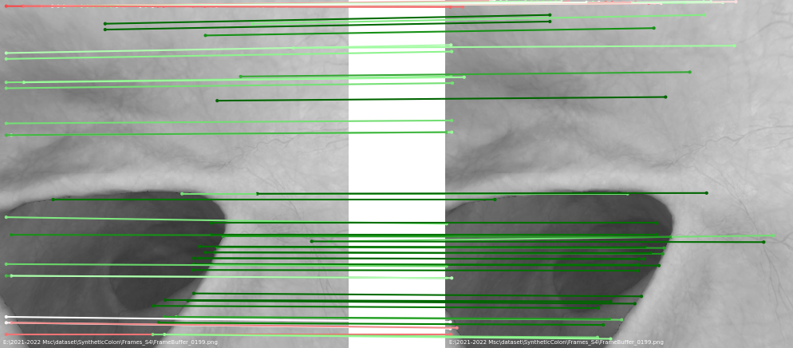
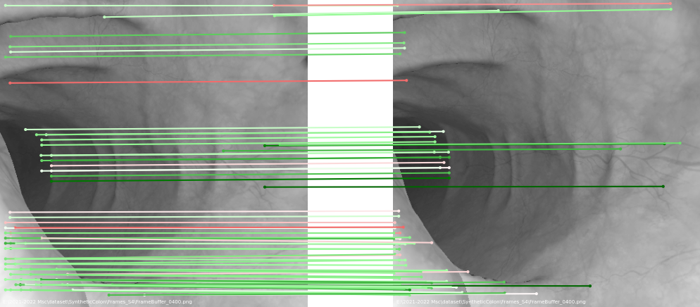
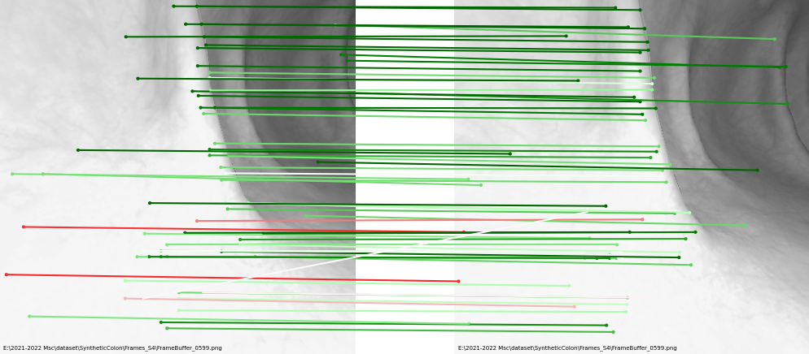

# SuperGlue PyTorch Implementation

## Introduction
 The SuperGlue network is a Graph Neural Network combined with an Optimal Matching layer that is trained to perform matching on two sets of sparse image features. This repo includes PyTorch code for training the SuperGlue matching network on top of [SuperPoint](https://arxiv.org/abs/1911.11763). SuperGlue operates as a "middle-end," performing context aggregation, matching, and filtering in a single end-to-end architecture. For more details, please see:

* Full paper PDF: [SuperGlue: Learning Feature Matching with Graph Neural Networks](https://arxiv.org/abs/1911.11763).
* Note: this repo is based on the work of HeatherJiaZG https://github.com/HeatherJiaZG/SuperGlue-pytorch.

This work aims to reproduce the SuperGlue, and then tune it with [SimCol dataset](https://arxiv.org/abs/2204.04968) in two different methods: Homography-based and Camera Pose-based methods.
## Dependencies
* Python 3
* PyTorch >= 1.1
* OpenCV >= 3.4 (4.1.2.30 recommended for best GUI keyboard interaction, see this [note](#additional-notes))
* Matplotlib >= 3.1
* NumPy >= 1.18

Simply run the following command: `pip3 install numpy opencv-python torch matplotlib`

Or create a conda environment by `conda install --name myenv --file superglue.txt`

## Dataset

Please Download SimCol dataset the link below:

https://www.synapse.org/#!Synapse:syn28548633/wiki/617130

which needs the permission of the owner, so please first apply on the web page.

The folder structure should look like (use SyntheticColon_I as example):
```
datasets/ ($DATA_DIR)
`-- SyntheticColon_I (accumulated folders from raw data)
|   |-- Frames_S1
|   |   |-- Depth_0000.png/
|   |   |-- ...
|   `-- Frames_S2
|   |   |-- Depth_0000.png/
|   |   |-- ...
...
|   |-- Frames_S14
|   |   |-- Depth_0000.png/
|   |   |-- ...
|   |SavedPosition_S1.txt
|   |SavedPosition_S2.txt
...
|   |SavedPosition_S14.txt
|   |SavedRotationQuaternion_S1.txt
|   |SavedRotationQuaternion_S2.txt
...
|   |SavedRotationQuaternion_S14.txt
|   |train.txt
|   |val.txt

```

## Contents
There are one main top-level scripts in this repo:

1. `train.py` : trains the superglue model.
2. `datasets/superpoint_gauss2_dataset.py`: reads images from files and creates pairs. It generates keypoints, descriptors by tuned SuperPoint and ground truth matches which will be used in training.

## Weights
1. Tuned SuperPoint weight: models\weights\superPointNet_114000_checkpoint.pth.tar
2. Tuned SuperGlue weight by Homography: models\weights\indoor_homo_model_epoch_2.pth
3. Tuned SuperGlue weight by Camera Pose and Intrinsics: models\weights\indoor_cam_model_epoch_2.pth

### Training Directions

To train the SuperGlue with default parameters (SuperPoint detector), run the following command:

```sh
python train.py
```

### Additional useful command line parameters
* Use `--detector` to set the detector mode : `superpoint`,`sift`, or `superpoint_gauss2` (our tuned SuperPoint)  (default: `superpoint_gauss2`).
* Use `--epoch` to set the number of epochs (default: `10`).
* Use `--train_path` to set the path to the directory of training images.
* Use `--eval_output_dir` to set the path to the directory in which the visualizations is written (default: `dump_match_pairs/`).
* Use `--show_keypoints` to visualize the detected keypoints (default: `False`).
* Use `--viz_extension` to set the visualization file extension (default: `png`). Use pdf for highest-quality.

### Visualization Demo
The matches are colored by their predicted confidence in a jet colormap (Green: more confident, Red: less confident).






